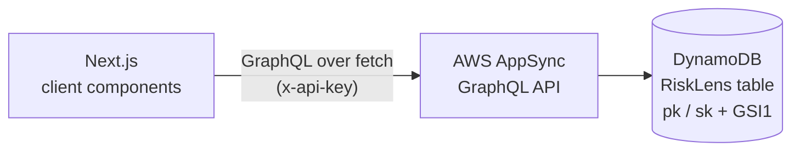
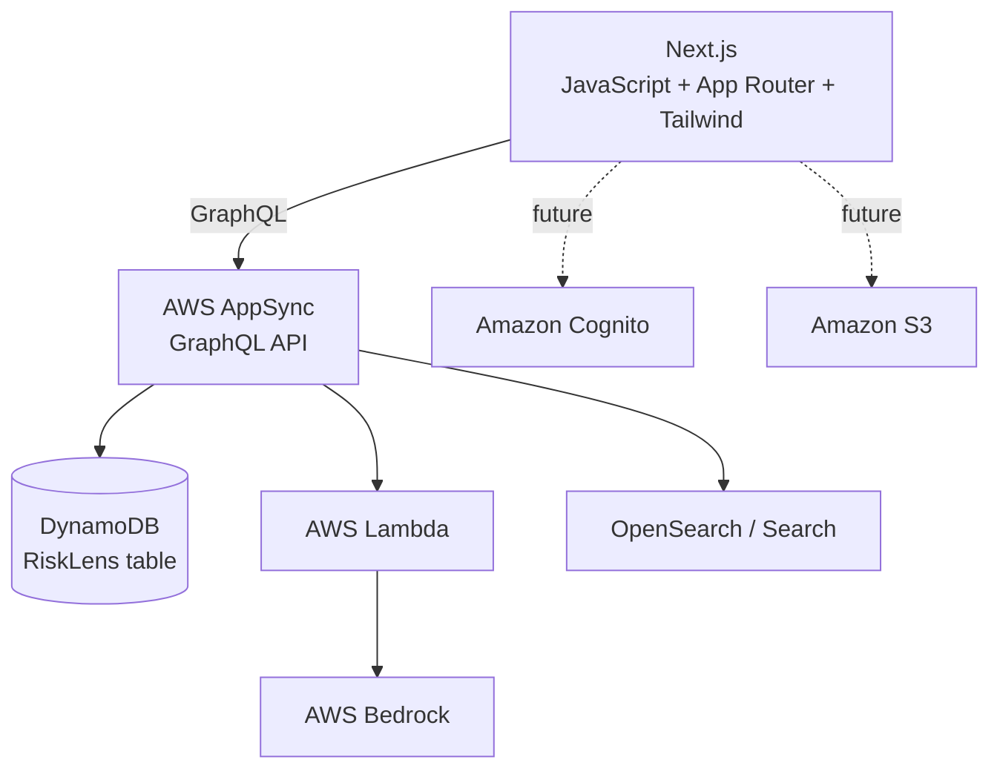

# RiskLens

**RiskLens** is an AI-powered risk and incident intelligence platform being
built with Next.js and an AWS-first backend. It is intended to help
organizations log workplace/operational incidents, understand their risk
posture, and eventually use AI (AWS Bedrock) to summarize incidents,
classify risk, and suggest corrective actions.

- **What it is:** an incident logging and risk-intelligence web application.
- **Problem it solves:** incidents are often reported in spreadsheets or
  disconnected forms with no structured history, no consistent risk scoring,
  and no way to surface patterns across past incidents.
- **Who it's for:** safety/risk/operations teams that need a single place to
  record incidents, track their status, and (in later phases) get
  AI-assisted analysis instead of manually reviewing every report.
- **Why AI/Bedrock:** the long-term value of RiskLens is not just data entry
  — it's using AWS Bedrock to summarize incidents, flag severity/risk
  patterns, surface similar past incidents, and recommend corrective and
  preventive actions, backed by a knowledge base of policies and past
  incidents (RAG).

> This README distinguishes **Current** (verified in the codebase),
> **Planned** (near-term, designed but not built), and **Future** (product
> direction) capabilities. Nothing below is claimed as working unless it
> was verified directly in the code (and, for the AppSync integration,
> against the live AppSync API).

---

## Current Status

```text
Phase 1 — Foundation & AppSync/GraphQL Incident Integration
Status: Complete
```

The original 10-phase roadmap scoped "AppSync + GraphQL API layer" and
"Incident CRUD" as separate Phases 2 and 3. They shipped together as one
AppSync-backed MVP and are folded into Phase 1 here — see
[Development Roadmap](#development-roadmap) for the renumbered plan.

Verified as implemented today:

- Next.js App Router project (JavaScript, no TypeScript), Tailwind CSS v4,
  ESLint flat config.
- A native-`fetch` GraphQL client (`src/graphql/client/appsync.js`) that
  posts to AWS AppSync with API-key auth, validates required env vars up
  front, and distinguishes network errors / HTTP errors / GraphQL errors.
- GraphQL operations matching the deployed AppSync schema exactly:
  `GetIncidents`, `GetIncident`, `CreateIncident`
  (`src/graphql/queries/`, `src/graphql/mutations/`).
- An application service layer (`src/lib/incidents.js`) exposing
  `getIncidents()`, `getIncident(id)`, `createIncident(input)` — no
  DynamoDB keys, table names, or GSI names appear anywhere above this
  layer.
- `/incidents` — list page wired to `getIncidents()`, with loading,
  error, and empty states, and "Load More" pagination that appends pages
  via AppSync's `nextToken` (never replaces existing items).
- `/incidents/new` — create form wired to `createIncident()`; on success
  it redirects to the new incident's detail page.
- `/incidents/[id]` — incident detail page (did not exist before this
  phase) wired to `getIncident(id)`, with loading, not-found, and error
  states.
- Verified against the **live AppSync API** (not mocked): a direct
  `curl` to the AppSync endpoint confirmed real incident data returns in
  the expected shape; `npm run lint` and `npm run build` both pass; the
  dev server serves `/incidents`, `/incidents/new`, and a real
  `/incidents/<id>` with HTTP 200.

Removed as part of this phase (superseded by AppSync):

- `src/app/api/incidents/route.js` — the old Next.js Route Handler (had
  a broken import and was never called by any UI).
- `src/lib/aws/dynamodb.js`, `src/lib/aws/incident.js` — direct DynamoDB
  access layer.
- `@aws-sdk/client-dynamodb`, `@aws-sdk/lib-dynamodb` — uninstalled from
  `package.json`/`package-lock.json` (no longer used anywhere).
- `src/app/graphql-test/` — a scratch page used to manually verify the
  GraphQL client during development.

**Next.js no longer talks to DynamoDB directly for Incident
functionality.** The only data path is `Next.js → AppSync → GraphQL →
DynamoDB`.

Not yet implemented: Incident update/delete (AppSync doesn't expose
those operations yet), authentication, S3 attachments, Bedrock AI
analysis, tests, CI/CD, and infrastructure-as-code. See
[Development Roadmap](#development-roadmap).

---

## Technology Stack

| Technology | Status | Notes |
|---|---|---|
| Next.js (App Router, JavaScript) | **Implemented** | Next.js 16, React 19, `reactCompiler: true` enabled in `next.config.mjs` |
| Tailwind CSS | **Implemented** | Tailwind v4 via `@tailwindcss/postcss` |
| ESLint | **Implemented** | Flat config (`eslint.config.mjs`) extending `eslint-config-next` |
| AWS AppSync + GraphQL | **Implemented** | Primary API layer for Incident functionality; API-key auth (dev-only) |
| Amazon DynamoDB | **Implemented (via AppSync only)** | Single table `RiskLens` (`pk`/`sk` + `GSI1`), accessed exclusively through AppSync resolvers — no direct SDK usage remains in the app |
| AWS Lambda | **Planned** | For business logic between AppSync and Bedrock/other services |
| AWS Bedrock | **Future** | AI summarization, risk scoring, RAG |
| Amazon S3 | **Future** | Incident attachments |
| Amazon Cognito | **Future** | Authentication — no auth exists in the app today; AppSync currently uses a temporary dev API key |
| OpenSearch | **Future** | Vector/similar-incident search |
| Testing framework | **Not configured** | No unit/integration/e2e test tooling present in `package.json` (deliberate choice for this project) |
| CI/CD | **Not configured** | No `.github/workflows` or other pipeline config present |

Do not treat Lambda, Bedrock, Cognito, S3, or OpenSearch as already
integrated — none of them appear in `package.json` or the source tree.

---

## Architecture

### Current (verified) — Incident functionality



`src/graphql/client/appsync.js` posts to `NEXT_PUBLIC_APPSYNC_URL` with
`NEXT_PUBLIC_APPSYNC_API_KEY`. `src/lib/incidents.js` is the only caller
of that client; UI pages call `src/lib/incidents.js`, never the GraphQL
client or AppSync directly. DynamoDB `pk`/`sk`/`GSI1PK`/`GSI1SK` values
are generated inside AppSync resolvers and are never constructed by the
frontend.

### Target architecture



Lambda, OpenSearch, Bedrock, Cognito, and S3 are target/future
components and are not implemented yet. The AppSync API-key auth used
today is explicitly a development-only stand-in for Cognito +
AppSync-authorization, which is planned (see
[Development Roadmap](#development-roadmap)) — the GraphQL client was
written so that swap doesn't require touching `src/lib/incidents.js` or
any UI component.

API Gateway is intentionally **not** part of the architecture and
should only be introduced later for a specific integration that
requires it (e.g. a webhook receiver).

---

## DynamoDB Single Table Design

```text
Table: RiskLens
Partition Key (pk): string
Sort Key (sk): string
GSI: GSI1 (GSI1PK / GSI1SK)
```

This design lives entirely behind AppSync now. The application code
does **not** assume a plain `id` partition key, and does not construct
`pk`, `sk`, `GSI1PK`, or `GSI1SK` anywhere — those are backend
persistence details owned by the AppSync resolvers.

**Access patterns confirmed working via the AppSync API (verified
manually in the AppSync console and via this migration):**

```text
pk                    sk          Used by (via AppSync resolver)
──────────────────────────────────────────────────────────────
INCIDENT#<id>         METADATA    createIncident, incident(id)

GSI1PK                GSI1SK                       Used by
──────────────────────────────────────────────────────────────
INCIDENTS              CREATED#<timestamp>#<id>    incidents(limit, nextToken)
```

`incidents(limit, nextToken)` is backed by a `GSI1` query (not a table
scan), and supports cursor-based pagination via `nextToken` — the
Next.js list page and service layer already integrate with this (see
[Current Status](#current-status)).

**Planned / future entity key strategy** (conceptual — not yet
implemented, no additional attributes or indexes should be assumed):

```text
pk                    sk
────────────────────────────────────
INCIDENT#123          METADATA
INCIDENT#123          ANALYSIS
INCIDENT#123          ACTION#001
INCIDENT#123          ATTACHMENT#001

USER#456              PROFILE

ORG#789               METADATA
ORG#789               USER#456
```

Do not create additional DynamoDB tables per entity — this project uses
single-table design on the existing `RiskLens` table, and do not change
`pk`/`sk`/`GSI1` without an explicit, documented reason.

---

## Local Development

Commands below are taken directly from `package.json` — no other scripts
exist.

```bash
npm install
npm run dev      # start the Next.js dev server
npm run build    # production build
npm run start    # run the production build
npm run lint     # ESLint
```

There is currently no `npm test` script — no test framework is
configured, and none is planned for this project at this time.

---

## Environment Variables

The application currently reads two environment variables (verified in
`src/graphql/client/appsync.js`):

```env
NEXT_PUBLIC_APPSYNC_URL=
NEXT_PUBLIC_APPSYNC_API_KEY=
```

- Values above are **placeholders only** — never commit real values.
- `.gitignore` ignores `.env*`, which covers `.env`, `.env.local`, and
  `.env.*.local`.
- Missing either variable produces a clear thrown error from
  `executeGraphQL()` rather than a confusing `fetch` failure.
- The API key is a **temporary development credential**. It is not
  designed to be hard to replace: swapping to Cognito + AppSync IAM/user
  pool authorization later only touches `src/graphql/client/appsync.js`
  (the header it sends), not the service layer or UI.
- No AWS access key/secret/session-token variables are used by the app —
  the frontend never talks to AWS SDKs or DynamoDB directly.
- There is no `.env.example` file in the repo yet; consider adding one
  for onboarding (documentation-only suggestion, not created here).

---

## Project Structure

### Current (verified)

```text
risklens/
├── src/
│   ├── app/
│   │   ├── dashboard/page.js            # static stat cards (not yet migrated)
│   │   ├── incidents/page.js            # list — wired to getIncidents(), pagination
│   │   ├── incidents/new/page.js        # create form — wired to createIncident()
│   │   ├── incidents/[id]/page.js       # detail — wired to getIncident(id)
│   │   ├── layout.js
│   │   ├── page.js                      # redirects to /dashboard
│   │   └── globals.css
│   ├── components/
│   │   ├── incidents/                   # empty
│   │   ├── layout/                      # empty
│   │   └── ui/                          # empty
│   ├── config/                          # empty
│   ├── graphql/
│   │   ├── client/appsync.js            # executeGraphQL() — fetch + auth + error handling
│   │   ├── queries/incidents.js         # GET_INCIDENTS
│   │   ├── queries/incident.js          # GET_INCIDENT
│   │   └── mutations/createIncident.js  # CREATE_INCIDENT
│   └── lib/
│       ├── incidents.js                 # service layer: getIncidents/getIncident/createIncident
│       └── utils/                       # empty
├── public/
├── .env                                 # local only, gitignored
├── .gitignore
├── AGENTS.md                            # auto-generated by `next dev`, plus project notes
├── CLAUDE.md
├── README.md
├── package.json
└── package-lock.json
```

### Target (introduce gradually, do not create ahead of need)

```text
risklens/
├── src/
│   ├── app/
│   │   ├── dashboard/
│   │   ├── incidents/{new,[id]}/
│   │   ├── login/                       # once Cognito is added
│   │   └── api/                         # only if a specific integration requires it
│   ├── components/{layout,incidents,dashboard,ai,ui}/
│   ├── graphql/{queries,mutations,fragments,client}/
│   ├── lib/{auth,utils,validation}/
│   ├── services/{incidents,ai,users}/
│   ├── config/
│   └── types/
├── tests/{unit,integration,e2e}/
├── infrastructure/{appsync,dynamodb,lambda,s3,cognito,iam}/
└── public/
```

`src/graphql/` and the `src/lib/incidents.js` service-layer pattern are
now real, not aspirational — extend them (`src/lib/<entity>.js` per
entity) rather than inventing a different pattern. Each remaining
top-level folder above should only be created when the feature that
needs it is actually being implemented, not preemptively.

---

## Development Roadmap

```text
Phase 1 — Foundation & AppSync/GraphQL Incident Integration — ✅ Complete
Phase 2 — Incident Update/Delete + Cognito Authentication
Phase 3 — S3 Attachments
Phase 4 — Bedrock AI Analysis (summarization, risk scoring)
Phase 5 — RAG / Knowledge Base (policies, procedures, historical incidents)
Phase 6 — Similar Incident Detection (embeddings + vector search)
Phase 7 — Dashboard & Analytics (wire /dashboard to real AppSync data)
Phase 8 — Production Hardening (CI/CD, observability, IAM review)
```

(Renumbered from the original 10-phase plan: "AppSync + GraphQL API
layer" and "Incident CRUD" were originally separate Phases 2–3; they
shipped as one unit and are now folded into Phase 1.)

---

## Known Issues (verified in current code)

- **No update/delete:** the deployed AppSync API only exposes
  `createIncident`, `incident`, and `incidents` — there was never an
  edit/delete UI to migrate, and none has been invented. Planned for
  Phase 2 once the corresponding AppSync resolvers exist.
- **No authentication:** any visitor can reach every route; AppSync
  itself is only protected by a development API key, not real
  authorization. Planned for Phase 2 (Cognito).
- **Dashboard not migrated:** `/dashboard` still renders hardcoded
  stat cards (`0` for every metric) — it was out of scope for the
  Incident-functionality migration and is planned for Phase 7.
- **Empty scaffolding:** `src/components/*`, `src/config/`, and
  `src/lib/utils/` exist but contain no files yet.
- **No tests, no CI/CD:** deliberate for this project at this stage —
  no test framework or pipeline is configured, and none is currently
  planned.
- **`.gitignore` entries for `AGENTS.md`/`CLAUDE.md` are now
  effective:** both files were untracked from git (`git rm --cached`)
  during this phase, so the existing `.gitignore` rule for them now
  actually applies — they stay local-only going forward.

## Future Risks (not current bugs — considerations for later phases)

- **Cognito:** once authentication is added, every route and every
  AppSync operation needs explicit authorization — none exist today, so
  nothing should be assumed "already protected." The API-key header in
  `src/graphql/client/appsync.js` will need to become a Cognito-derived
  auth token; the service-layer boundary was kept clean specifically so
  this swap is localized.
- **S3 attachments:** will require careful IAM scoping (pre-signed URLs,
  not direct client credentials) and virus/type validation before
  incidents can carry uploads.
- **Bedrock/RAG:** must not be called directly from the browser; route
  through Lambda/AppSync resolvers to avoid exposing model access or
  prompts to the client. Cost/latency of Bedrock calls should be
  considered before making them synchronous with user-facing requests.
- **OpenSearch:** introduces an additional stateful service to operate,
  secure, and keep in sync with DynamoDB — plan for eventual consistency
  between the two.
- **Multi-tenancy:** the current `pk`/`sk`/`GSI1` design has no `ORG#`
  scoping yet; retrofitting tenant isolation later is more disruptive
  than designing for it before update/delete and Cognito land.
- **Update/delete concurrency:** once `updateIncident` exists, decide on
  an optimistic-locking or last-write-wins strategy before shipping it —
  not yet designed.

---

## Production Readiness Assessment

| Dimension | Status | Notes |
|---|---|---|
| Architecture | **Needs Work** | Incident read/create flow now correctly goes through AppSync/GraphQL; Lambda/Bedrock/S3/Cognito layers not started |
| Security | **Needs Work** | No authentication/authorization anywhere; AppSync uses a temporary dev API key by design; no AWS keys committed |
| Repository structure | **Ready** | `src/graphql/` + `src/lib/incidents.js` service-layer pattern is in place and matches the target structure; dead code (old REST route, DynamoDB layer, scratch page) removed |
| Environment configuration | **Needs Work** | `.env` correctly gitignored; env vars validated with clear errors; no `.env.example` yet for onboarding |
| AWS integration readiness | **Needs Work** | AppSync/DynamoDB integration for Incidents is working end-to-end; Lambda/Bedrock/S3/Cognito not yet integrated |
| Testing readiness | **Future** | No test framework configured — deliberate choice for this project |
| Scalability | **Needs Work** | `incidents()` now queries `GSI1` with cursor pagination (no more unscoped scan-like pattern); no `ORG#` tenant scoping yet |
| Maintainability | **Ready** | Clean UI → service layer → GraphQL client → AppSync separation; no GraphQL queries embedded in UI components |
| Documentation | **Ready** | README/CLAUDE.md/AGENTS.md reflect verified current vs. planned vs. future state as of Phase 1 completion |

This is Phase 1 of an evolving system, not a production-ready system.
Treat every "Planned"/"Future" item above as not built until it is
verified in code again.
