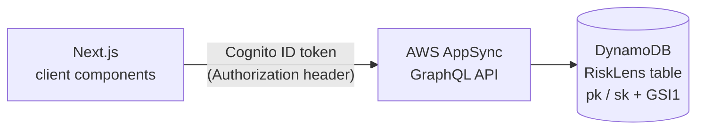
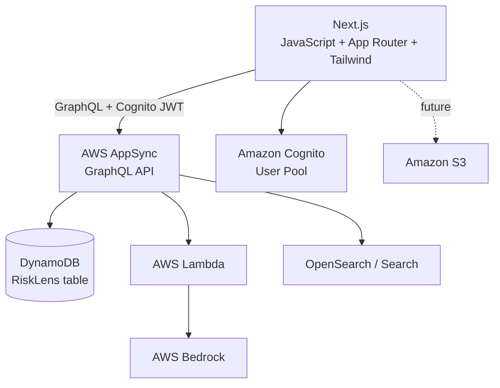

# RiskLens

**RiskLens** is an AI-powered risk and incident intelligence platform being
built with Next.js and an AWS-first backend. It is intended to help
organizations log workplace/operational incidents, understand their risk
posture, and eventually use AI (AWS Bedrock) to summarize incidents,
classify risk, and suggest corrective actions.

- **What it is:** an incident logging and risk-intelligence web application.
- **Problem it solves:** incidents are often reported in spreadsheets or
  disconnected forms with no structured history, no consistent risk scoring,
  and no way to surface patterns across past incidents.
- **Who it's for:** safety/risk/operations teams that need a single place to
  record incidents, track their status, and (in later phases) get
  AI-assisted analysis instead of manually reviewing every report.
- **Why AI/Bedrock:** the long-term value of RiskLens is not just data entry
  — it's using AWS Bedrock to summarize incidents, flag severity/risk
  patterns, surface similar past incidents, and recommend corrective and
  preventive actions, backed by a knowledge base of policies and past
  incidents (RAG).

> This README distinguishes **Current** (verified in the codebase),
> **Planned** (near-term, designed but not built), and **Future** (product
> direction) capabilities. Nothing below is claimed as working unless it
> was verified directly in the code (and, for the AppSync integration,
> against the live AppSync API).

---

## Current Status

```text
Phase 1 — Foundation & AppSync/GraphQL Incident Integration
Status: Complete

Phase 2 — Cognito Authentication
Status: Complete
```

The original 10-phase roadmap scoped "AppSync + GraphQL API layer" and
"Incident CRUD" as separate Phases 2 and 3. They shipped together as one
AppSync-backed MVP and are folded into Phase 1 here — see
[Development Roadmap](#development-roadmap) for the renumbered plan.

**Phase 2 status in detail:** Cognito User Pool authentication is fully
integrated end-to-end. Login, logout, session handling, the client-side
route guard, and Cognito-authenticated `GetIncidents`/`GetIncident`/
`CreateIncident` calls have all been verified working. The AppSync API
now enforces Cognito User Pool authorization (previously it only
accepted `x-api-key` — see [Authentication](#authentication) for how
this was confirmed). The frontend no longer depends on the AppSync API
key for authenticated Incident functionality.

Verified as implemented today:

- Next.js App Router project (JavaScript, no TypeScript), Tailwind CSS v4,
  ESLint flat config.
- A native-`fetch` GraphQL client (`src/graphql/client/appsync.js`) that
  posts to AWS AppSync with a Cognito ID token as the `Authorization`
  header, validates required env vars up front, and distinguishes
  network errors / HTTP errors / GraphQL errors.
- GraphQL operations matching the deployed AppSync schema exactly:
  `GetIncidents`, `GetIncident`, `CreateIncident`
  (`src/graphql/queries/`, `src/graphql/mutations/`).
- An application service layer (`src/lib/incidents.js`) exposing
  `getIncidents()`, `getIncident(id)`, `createIncident(input)` — no
  DynamoDB keys, table names, or GSI names appear anywhere above this
  layer.
- `/incidents` — list page wired to `getIncidents()`, with loading,
  error, and empty states, and "Load More" pagination that appends pages
  via AppSync's `nextToken` (never replaces existing items).
- `/incidents/new` — create form wired to `createIncident()`; on success
  it redirects to the new incident's detail page.
- `/incidents/[id]` — incident detail page wired to `getIncident(id)`,
  with loading, not-found, and error states.
- Cognito User Pool authentication (`src/lib/amplify.js`,
  `src/lib/auth.js`, `src/components/AmplifyProvider.js`) with a public
  app client (no client secret), login/logout, and a client-side route
  guard (`src/app/(app)/layout.js`) protecting `/dashboard` and all
  `/incidents*` routes.
- Verified against the **live AppSync API** (not mocked): both the
  Incident read/create flow and the Cognito authorization switch were
  confirmed with direct requests to the AppSync endpoint, not just code
  review; `npm run lint` and `npm run build` both pass.

Removed as part of this phase (superseded by AppSync):

- `src/app/api/incidents/route.js` — the old Next.js Route Handler (had
  a broken import and was never called by any UI).
- `src/lib/aws/dynamodb.js`, `src/lib/aws/incident.js` — direct DynamoDB
  access layer.
- `@aws-sdk/client-dynamodb`, `@aws-sdk/lib-dynamodb` — uninstalled from
  `package.json`/`package-lock.json` (no longer used anywhere).
- `src/app/graphql-test/` — a scratch page used to manually verify the
  GraphQL client during development.

**Next.js no longer talks to DynamoDB directly for Incident
functionality.** The only data path is `Next.js → AppSync → GraphQL →
DynamoDB`.

Not yet implemented: Incident update/delete (AppSync doesn't expose
those operations yet), S3 attachments, Bedrock AI analysis, tests,
CI/CD, and infrastructure-as-code. See
[Development Roadmap](#development-roadmap).

---

## Technology Stack

| Technology | Status | Notes |
|---|---|---|
| Next.js (App Router, JavaScript) | **Implemented** | Next.js 16, React 19, `reactCompiler: true` enabled in `next.config.mjs` |
| Tailwind CSS | **Implemented** | Tailwind v4 via `@tailwindcss/postcss` |
| ESLint | **Implemented** | Flat config (`eslint.config.mjs`) extending `eslint-config-next` |
| AWS AppSync + GraphQL | **Implemented** | Primary API layer for Incident functionality; enforces Cognito User Pool authorization — see [Authentication](#authentication) |
| Amazon DynamoDB | **Implemented (via AppSync only)** | Single table `RiskLens` (`pk`/`sk` + `GSI1`), accessed exclusively through AppSync resolvers — no direct SDK usage remains in the app |
| Amazon Cognito | **Implemented** | User Pool + public app client (no secret); sign-in/sign-out work, and AppSync validates Cognito ID tokens for authenticated Incident operations |
| AWS Amplify (`aws-amplify`) | **Implemented** | `Auth` category only, configured once via `src/components/AmplifyProvider.js`; no other Amplify categories used |
| AWS Lambda | **Planned** | For business logic between AppSync and Bedrock/other services |
| AWS Bedrock | **Future** | AI summarization, risk scoring, RAG |
| Amazon S3 | **Future** | Incident attachments |
| OpenSearch | **Future** | Vector/similar-incident search |
| Testing framework | **Not configured** | No unit/integration/e2e test tooling present in `package.json` (deliberate choice for this project) |
| CI/CD | **Not configured** | No `.github/workflows` or other pipeline config present |

Do not treat Lambda, Bedrock, S3, or OpenSearch as already integrated —
none of them appear in `package.json` or the source tree. Cognito and
AppSync authorization are both real and enforced — see
[Authentication](#authentication).

---

## Architecture

### Current (verified) — Incident functionality



`src/graphql/client/appsync.js` fetches the current Cognito session via
`src/lib/auth.js` and posts to `NEXT_PUBLIC_APPSYNC_URL` with the ID
token as the `Authorization` header — no API key is sent by the app
anymore. `src/lib/incidents.js` is the only caller of that client; UI
pages call `src/lib/incidents.js`, never the GraphQL client, Amplify, or
AppSync directly. DynamoDB `pk`/`sk`/`GSI1PK`/`GSI1SK` values are
generated inside AppSync resolvers and are never constructed by the
frontend.

This is now the verified working state — see
[Authentication](#authentication) for how the AppSync-side Cognito
authorization was confirmed.

### Target architecture



Lambda, OpenSearch, Bedrock, and S3 are target/future components and are
not implemented yet. Cognito and the AppSync authorization link to it
(`A --> G`, and AppSync validating `G`'s tokens) are both real and
enforced today, not aspirational.

API Gateway is intentionally **not** part of the architecture and
should only be introduced later for a specific integration that
requires it (e.g. a webhook receiver).

---

## Authentication

Phase 2 is **complete**: Cognito User Pool authentication is integrated
with AppSync's Cognito User Pool authorization, and the full Incident
flow (list, detail, create, pagination) has been verified working
end-to-end for an authenticated user, alongside login, logout, session
handling, and route protection for unauthenticated access.

### What's implemented (verified)

- **Cognito User Pool + public app client** (no client secret) — created
  outside this repo; sign-in confirmed working before this migration
  started.
- **`src/lib/amplify.js`** — `configureAmplify()`, idempotent, validates
  `NEXT_PUBLIC_COGNITO_USER_POOL_ID` / `NEXT_PUBLIC_COGNITO_CLIENT_ID` /
  `NEXT_PUBLIC_COGNITO_REGION` with clear errors if missing.
- **`src/components/AmplifyProvider.js`** — mounted once, in
  `src/app/layout.js`, wrapping the whole app. It calls
  `configureAmplify()` directly during render (not inside a `useEffect`)
  specifically so Amplify is configured before any nested page's effects
  run — React fires child effects before parent effects, so an
  effect-based approach here would race. This was previously built but
  never mounted anywhere; fixed as part of this phase.
- **`src/lib/auth.js`** — the single authentication service:
  `login(email, password)`, `logout()`, `getAuthenticatedUser()`,
  `getAuthSession()`. This is the only file that imports from
  `aws-amplify/auth` directly; everything else (the login page, the
  route guard, the GraphQL client) goes through this file.
- **`/login`** (`src/app/login/page.js`) — email/password form using
  `src/lib/auth.js`, not Cognito APIs directly. Handles loading state,
  wrong-credential/missing-field errors (surfaced from Amplify's own
  error messages), and redirects already-authenticated visitors away
  from `/login`. No debug logging of session/token data (removed during
  this phase — the previous version logged the full sign-in result and
  session object, including raw JWTs, to the browser console).
- **Route protection** (`src/app/(app)/layout.js`) — `/dashboard`,
  `/incidents`, `/incidents/new`, and `/incidents/[id]` were moved into
  an `(app)` route group (a Next.js route group — it does not change any
  URL) with a shared client-side layout that checks for a Cognito
  session (via `getAuthSession()`) on mount, redirects to `/login` if
  there's no session, and renders a small header with a working
  "Sign out" button. **This is a UX guard, not a security boundary** —
  see the note below.
- **`src/graphql/client/appsync.js`** — calls `getAuthSession()`, reads
  `session.tokens.idToken`, and sends it as the `Authorization` header.
  If there's no session it throws `"No authenticated Cognito session
  found"` instead of an obscure `fetch` failure. Network errors, JSON
  parse errors, HTTP errors, and GraphQL errors are all handled and
  produce distinct messages (same layered error handling as Phase 1, now
  merged with the auth-session check).
- **ID token, not access token:** the client sends the Cognito **ID
  token**. This matches how Amplify's own AppSync integration behaves,
  and — unlike the access token — the ID token carries user attributes
  and `cognito:groups`, which the future roadmap's roles/organizations
  work will need.
- **AppSync now enforces Cognito User Pool authorization.** Confirmed
  working end-to-end: login → `/incidents` loading real data →
  `/incidents/new` creating a real incident → the new incident appearing
  in the list → `/incidents/[id]` loading it → sign out → protected
  routes requiring login again.
- **The frontend no longer depends on the AppSync API key for
  authenticated Incident functionality** — confirmed by repo-wide
  search: no application code sends `x-api-key` or reads
  `NEXT_PUBLIC_APPSYNC_API_KEY` anymore.

### How the AppSync-side switch was confirmed

This session independently re-checked AppSync's live behavior (not just
taking the AWS Console change on faith) and observed a clear before/after
change from the state recorded earlier in this project's history:

```text
Before (Phase 2 in progress):
  curl with only x-api-key         -> succeeded, returned real data
  curl with a well-formed fake JWT -> generic "Valid authorization header not provided"
                                       (identical to no header at all — AppSync wasn't
                                       attempting to validate a JWT at all)

Now (Phase 2 complete):
  curl with only x-api-key         -> {"errorType":"Unauthorized","message":
                                       "Not Authorized to access incidents on type Query"}
  curl with a well-formed fake JWT -> still the generic header error (a fake JWT
                                       correctly fails signature validation)
```

The `x-api-key`-only request now gets a **schema-level authorization
error specific to the `incidents` field**, rather than succeeding —
this is the behavior you'd expect once Cognito User Pool authorization
has been added to the API and the API key is no longer sufficient for
Incident operations on its own. (Confirming this precisely via `aws
appsync get-graphql-api` was attempted but denied — the local IAM user
doesn't have that read permission — so this is inferred from live
request/response behavior, consistent with the manual end-to-end browser
verification already performed.)

### Route protection: documented limitation

The `(app)` route-group guard is **client-side only** — it checks the
session after the page's JavaScript has loaded, using
`router.replace("/login")`. It does not use Next.js Middleware, because
Amplify Auth's default session storage in the browser is `localStorage`,
which Middleware (Edge runtime) cannot read — only cookies/headers on
the incoming request are visible there. Adding cookie-based
Middleware-enforced protection would require switching Amplify to
SSR/cookie-based session storage (`@aws-amplify/adapter-nextjs`), which
is a larger architectural change appropriate for a later phase, not a
one-line fix layered onto the current client-only setup.

**The real security boundary is AppSync itself**, now that Cognito User
Pool authorization is enforced there — a technical user could bypass the
client-side route guard, but they still couldn't get AppSync to return
data without a valid Cognito token. The route guard's job is UX
(redirecting people to `/login`, not letting a signed-out user see a
flash of protected UI), not access control. This limitation is still
current (unresolved by Phase 2) — see [Future Risks](#future-risks).

---

## DynamoDB Single Table Design

```text
Table: RiskLens
Partition Key (pk): string
Sort Key (sk): string
GSI: GSI1 (GSI1PK / GSI1SK)
```

This design lives entirely behind AppSync now. The application code
does **not** assume a plain `id` partition key, and does not construct
`pk`, `sk`, `GSI1PK`, or `GSI1SK` anywhere — those are backend
persistence details owned by the AppSync resolvers.

**Access patterns confirmed working via the AppSync API (verified
manually in the AppSync console and via this migration):**

```text
pk                    sk          Used by (via AppSync resolver)
──────────────────────────────────────────────────────────────
INCIDENT#<id>         METADATA    createIncident, incident(id)

GSI1PK                GSI1SK                       Used by
──────────────────────────────────────────────────────────────
INCIDENTS              CREATED#<timestamp>#<id>    incidents(limit, nextToken)
```

`incidents(limit, nextToken)` is backed by a `GSI1` query (not a table
scan), and supports cursor-based pagination via `nextToken` — the
Next.js list page and service layer already integrate with this (see
[Current Status](#current-status)).

**Planned / future entity key strategy** (conceptual — not yet
implemented, no additional attributes or indexes should be assumed):

```text
pk                    sk
────────────────────────────────────
INCIDENT#123          METADATA
INCIDENT#123          ANALYSIS
INCIDENT#123          ACTION#001
INCIDENT#123          ATTACHMENT#001

USER#456              PROFILE

ORG#789               METADATA
ORG#789               USER#456
```

Do not create additional DynamoDB tables per entity — this project uses
single-table design on the existing `RiskLens` table, and do not change
`pk`/`sk`/`GSI1` without an explicit, documented reason.

---

## Local Development

Commands below are taken directly from `package.json` — no other scripts
exist.

```bash
npm install
npm run dev      # start the Next.js dev server
npm run build    # production build
npm run start    # run the production build
npm run lint     # ESLint
```

There is currently no `npm test` script — no test framework is
configured, and none is planned for this project at this time.

---

## Environment Variables

The application currently reads these environment variables (verified in
`src/graphql/client/appsync.js`, `src/lib/amplify.js`):

```env
NEXT_PUBLIC_APPSYNC_URL=your-appsync-endpoint
NEXT_PUBLIC_APPSYNC_API_KEY=your-appsync-api-key

NEXT_PUBLIC_COGNITO_USER_POOL_ID=your-user-pool-id
NEXT_PUBLIC_COGNITO_CLIENT_ID=your-client-id
NEXT_PUBLIC_COGNITO_REGION=your-region
```

- Values above are **placeholders only** — never commit real values.
- `.gitignore` ignores `.env*`, which covers `.env`, `.env.local`, and
  `.env.*.local`.
- Missing any of the Cognito variables produces a clear thrown error
  from `configureAmplify()`; a missing `NEXT_PUBLIC_APPSYNC_URL`
  produces a clear error from `executeGraphQL()` — neither fails with a
  confusing raw `fetch`/SDK error.
- `NEXT_PUBLIC_APPSYNC_API_KEY` is **no longer read by any application
  code** (confirmed — nothing in `src/` references `x-api-key` or this
  variable anymore), and the frontend no longer depends on it for
  authenticated Incident functionality now that Cognito authorization is
  enforced on AppSync. It's still present in `.env` — this is a
  documentation-only note, not a change made here — and is safe to
  retire from `.env` and any external tooling (`curl`/Postman scripts)
  that still uses it, at your convenience.
- **Never create `NEXT_PUBLIC_COGNITO_CLIENT_SECRET`** — the app client
  is a public browser client with no secret, and Amplify's browser SDK
  doesn't use one. No AWS IAM access key/secret/session-token variables
  are used by the app — the frontend never talks to AWS SDKs or
  DynamoDB directly.
- There is no `.env.example` file in the repo yet; consider adding one
  for onboarding (documentation-only suggestion, not created here).

---

## Project Structure

### Current (verified)

```text
risklens/
├── src/
│   ├── app/
│   │   ├── (app)/                       # route group — no effect on URLs
│   │   │   ├── layout.js                # client-side auth guard + sign-out header
│   │   │   ├── dashboard/page.js        # static stat cards (not yet migrated)
│   │   │   └── incidents/
│   │   │       ├── page.js              # list — wired to getIncidents(), pagination
│   │   │       ├── new/page.js          # create form — wired to createIncident()
│   │   │       └── [id]/page.js         # detail — wired to getIncident(id)
│   │   ├── login/page.js                # sign-in form, uses src/lib/auth.js
│   │   ├── layout.js                    # root layout — mounts AmplifyProvider
│   │   ├── page.js                      # redirects to /dashboard
│   │   └── globals.css
│   ├── components/
│   │   ├── AmplifyProvider.js           # configures Amplify once, app-wide
│   │   ├── incidents/                   # empty
│   │   ├── layout/                      # empty
│   │   └── ui/                          # empty
│   ├── config/                          # empty
│   ├── graphql/
│   │   ├── client/appsync.js            # executeGraphQL() — Cognito auth + error handling
│   │   ├── queries/incidents.js         # GET_INCIDENTS
│   │   ├── queries/incident.js          # GET_INCIDENT
│   │   └── mutations/createIncident.js  # CREATE_INCIDENT
│   └── lib/
│       ├── amplify.js                   # configureAmplify()
│       ├── auth.js                      # login/logout/getAuthenticatedUser/getAuthSession
│       ├── incidents.js                 # service layer: getIncidents/getIncident/createIncident
│       └── utils/                       # empty
├── public/
├── .env                                 # local only, gitignored
├── .gitignore
├── AGENTS.md                            # auto-generated by `next dev`, plus project notes
├── CLAUDE.md
├── README.md
├── package.json
└── package-lock.json
```

### Target (introduce gradually, do not create ahead of need)

```text
risklens/
├── src/
│   ├── app/
│   │   ├── dashboard/
│   │   ├── incidents/{new,[id]}/
│   │   ├── login/                       # once Cognito is added
│   │   └── api/                         # only if a specific integration requires it
│   ├── components/{layout,incidents,dashboard,ai,ui}/
│   ├── graphql/{queries,mutations,fragments,client}/
│   ├── lib/{auth,utils,validation}/
│   ├── services/{incidents,ai,users}/
│   ├── config/
│   └── types/
├── tests/{unit,integration,e2e}/
├── infrastructure/{appsync,dynamodb,lambda,s3,cognito,iam}/
└── public/
```

`src/graphql/` and the `src/lib/incidents.js` service-layer pattern are
now real, not aspirational — extend them (`src/lib/<entity>.js` per
entity) rather than inventing a different pattern. Each remaining
top-level folder above should only be created when the feature that
needs it is actually being implemented, not preemptively.

---

## Development Roadmap

```text
Phase 1 — Foundation & AppSync/GraphQL Incident Integration — ✅ Complete
Phase 2 — Cognito Authentication — ✅ Complete
Phase 2.5 — Incident Update/Delete (once AppSync exposes updateIncident/deleteIncident) — ⬅ next up
Phase 3 — S3 Attachments
Phase 4 — Bedrock AI Analysis (summarization, risk scoring)
Phase 5 — RAG / Knowledge Base (policies, procedures, historical incidents)
Phase 6 — Similar Incident Detection (embeddings + vector search)
Phase 7 — Dashboard & Analytics (wire /dashboard to real AppSync data)
Phase 8 — Production Hardening (CI/CD, observability, IAM review)
```

(Renumbered from the original 10-phase plan: "AppSync + GraphQL API
layer" and "Incident CRUD" were originally separate Phases 2–3; they
shipped as one unit and are now folded into Phase 1.)

---

## Known Issues (verified in current code)

- **No update/delete:** the deployed AppSync API only exposes
  `createIncident`, `incident`, and `incidents` — there was never an
  edit/delete UI to migrate, and none has been invented. Planned for
  Phase 2.5 once the corresponding AppSync resolvers exist.
- **Route protection is client-side only**, by design for this
  architecture — see [Authentication](#authentication) for why
  Middleware doesn't fit here yet, and what would need to change for
  server-side enforcement.
- **Dashboard not migrated:** `/dashboard` still renders hardcoded
  stat cards (`0` for every metric) — it was out of scope for the
  Incident-functionality migration and is planned for Phase 7.
- **Empty scaffolding:** `src/components/{incidents,layout,ui}/`,
  `src/config/`, and `src/lib/utils/` exist but contain no files yet.
- **No tests, no CI/CD:** deliberate for this project at this stage —
  no test framework or pipeline is configured, and none is currently
  planned.
- **`.gitignore` entries for `AGENTS.md`/`CLAUDE.md` are now
  effective:** both files were untracked from git (`git rm --cached`)
  during Phase 1, so the existing `.gitignore` rule for them now
  actually applies — they stay local-only going forward.

## Future Risks (not current bugs — considerations for later phases)

- **Server-side route protection:** the current client-side guard is a
  UX affordance, not a security control (see
  [Authentication](#authentication)). True server-enforced protection
  would need Amplify's SSR/cookie adapter
  (`@aws-amplify/adapter-nextjs`) plus Next.js Middleware — a real
  architectural change, not a drop-in addition to the current setup.
- **S3 attachments:** will require careful IAM scoping (pre-signed URLs,
  not direct client credentials) and virus/type validation before
  incidents can carry uploads.
- **Bedrock/RAG:** must not be called directly from the browser; route
  through Lambda/AppSync resolvers to avoid exposing model access or
  prompts to the client. Cost/latency of Bedrock calls should be
  considered before making them synchronous with user-facing requests.
- **OpenSearch:** introduces an additional stateful service to operate,
  secure, and keep in sync with DynamoDB — plan for eventual consistency
  between the two.
- **Multi-tenancy:** the current `pk`/`sk`/`GSI1` design has no `ORG#`
  scoping yet; retrofitting tenant isolation later is more disruptive
  than designing for it before update/delete lands. Cognito
  authentication is real now, but it's still one flat user pool with no
  organization/role concept layered on top — keep Cognito identity
  (authentication) separate from future organization identity,
  authorization/roles, and Incident data when that work starts.
- **Update/delete concurrency:** once `updateIncident` exists, decide on
  an optimistic-locking or last-write-wins strategy before shipping it —
  not yet designed.

---

## Production Readiness Assessment

| Dimension | Status | Notes |
|---|---|---|
| Architecture | **Needs Work** | Incident read/create flow and Cognito authentication both correctly go through AppSync/GraphQL; Lambda/Bedrock/S3 layers not started |
| Security | **Needs Work** | Cognito login/logout/session work and AppSync now enforces Cognito User Pool authorization; still no MFA, no server-side (cookie/Middleware) route protection, and no roles/multi-tenancy; no AWS keys or client secrets committed |
| Repository structure | **Ready** | `src/graphql/` + `src/lib/incidents.js` service-layer pattern is in place and matches the target structure; dead code (old REST route, DynamoDB layer, scratch page) removed |
| Environment configuration | **Needs Work** | `.env` correctly gitignored; env vars validated with clear errors; no `.env.example` yet for onboarding |
| AWS integration readiness | **Needs Work** | AppSync/DynamoDB/Cognito integration for Incidents and authentication is working end-to-end; Lambda/Bedrock/S3 not yet integrated |
| Testing readiness | **Future** | No test framework configured — deliberate choice for this project |
| Scalability | **Needs Work** | `incidents()` now queries `GSI1` with cursor pagination (no more unscoped scan-like pattern); no `ORG#` tenant scoping yet |
| Maintainability | **Ready** | Clean UI → service layer → GraphQL client → AppSync separation; no GraphQL queries embedded in UI components |
| Documentation | **Ready** | README/CLAUDE.md/AGENTS.md reflect verified current vs. planned vs. future state as of Phase 1 completion |

This is Phase 1 and Phase 2 (both complete) of an evolving system, not a
production-ready system. Treat every "Planned"/"Future" item above as
not built until it is verified in code again.
